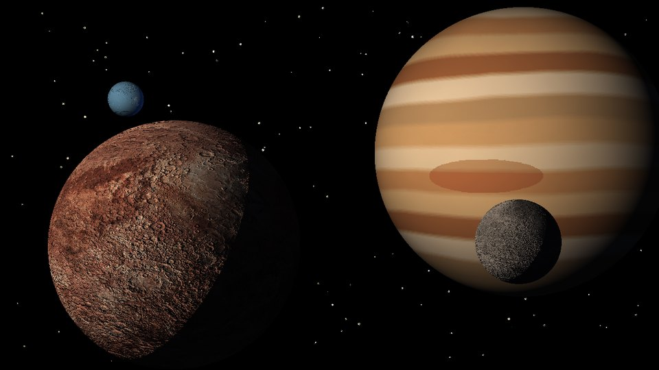
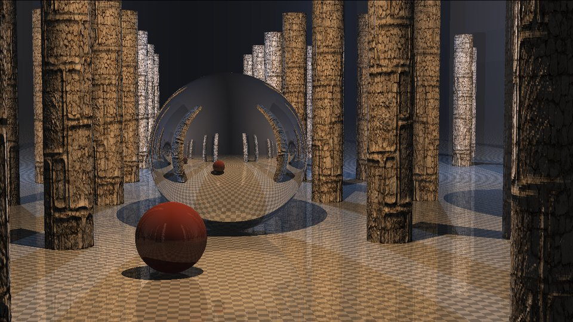
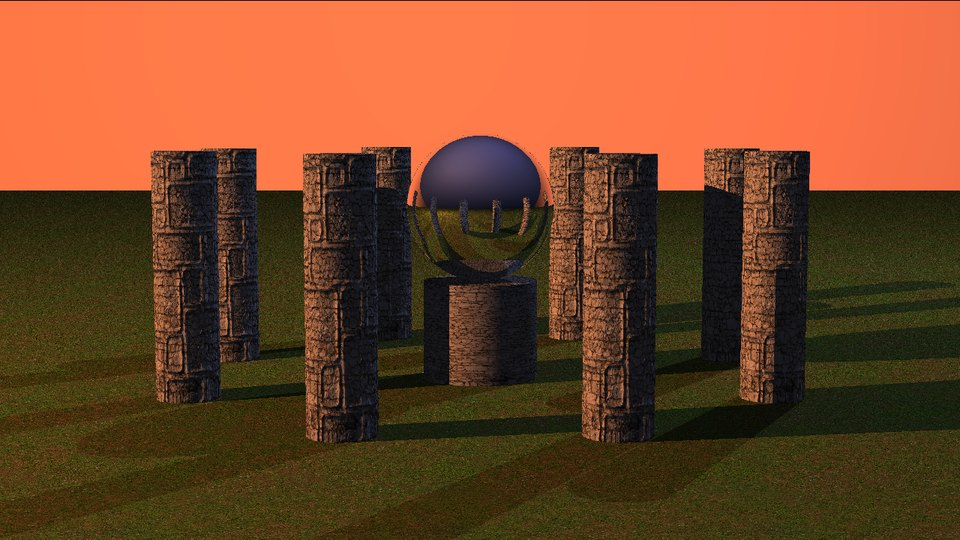
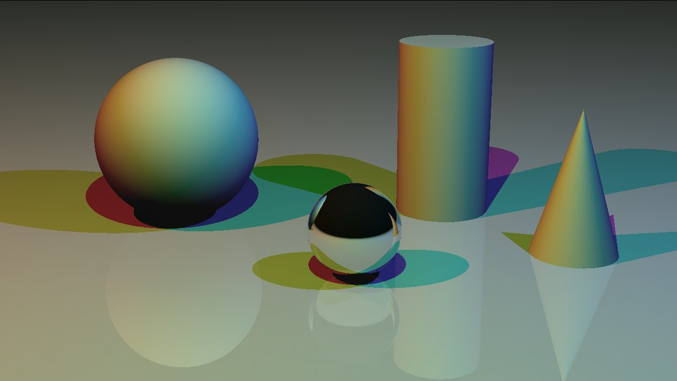
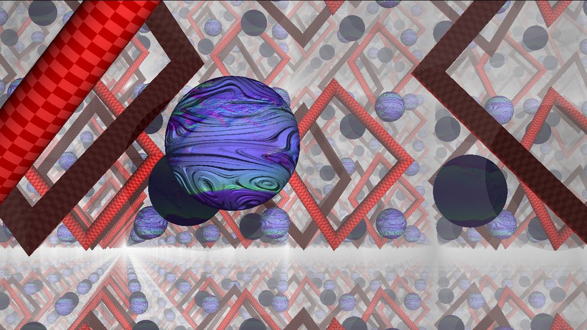

<!-- YoRHa archive -->
<p align="center"></p>

A multithreaded CPU ray tracer in C that renders `.rt` scene files with reflections, textures, bump maps and a free-flying camera.

## ▸ Overview
miniRT is the 42 ray-tracing project: parse a scene description, cast one ray per pixel, and shade the closest hit.
This version goes past the mandatory part: rays are distributed across worker threads (columns are handed out under a mutex),
surfaces can be reflective with recursive bounces, and each object can carry an XPM texture, an XPM bump map or a checkerboard pattern.
The camera can be moved and rotated live; each move re-launches the render.

## ▸ Renders
<p align="center">
  
</p>
<p align="center">
  
  
  
  
</p>

<sub>1280×720, rendered by this code (Linux build linked against a headless MiniLibX stand-in that dumps the frame). Scenes: `scenes/planets.rt`, `mirror_hall.rt`, `sunset_temple.rt`, `rgb_shadows.rt`, `MegaMirror.rt` (one texture swapped for another image from `imgs/`). `imgs/gas_giant.xpm` and `imgs/moon.xpm` are procedurally generated.</sub>

## ▸ Features
- Primitives: sphere, plane, cylinder (with caps), cone
- Ambient light plus any number of coloured point lights, with hard shadows
- Recursive reflections, mixed with the surface colour by a per-object `reflect` factor
- Per-object texture mapping and bump mapping from `.xpm` images, or procedural checkerboard
- Multithreaded rendering with `pthread` (12 threads on macOS, 50 on Linux build)
- Strict scene parser: file extension, field count, colour range, non-zero vectors, single `A` / `C`
- Interactive camera (macOS keymap): `W A S D` move, `Z` / `X` up / down, arrow keys rotate, `Esc` quits

## ▸ Usage
```bash
make                                  # macOS: builds bundled mlx + libft, links OpenGL/AppKit
./miniRT scenes/ComplexBonus.rt
make run FILE=scenes/pretty.rt        # build and run in one step
```

Scene lines (whitespace-separated). Every object line ends with five extra columns:
`spec reflect texture bump checker` (`0` = off, image paths must be `.xpm`, `checker` = `1` for a checkerboard).

```text
A   0.2                      255,255,255                 # ambient ratio, colour
C   0,0,-50     0,0,1        70                          # position, direction, FOV
L   0,10,-30    0.6          255,255,255                 # position, intensity, colour
sp  0,0,60      13           255,255,255  0 0   imgs/test_img.xpm imgs/fun-img.xpm 0
pl  0,-25,0     0,1,0        255,255,0    0 0.4 0 0 0
cy  5,-30,30    -0.8,1,0.5   5  100       255,0,0 0 0 0 0 1   # diameter, height
co  10,0,0      0,1,0.5      8  6         255,0,0 0 0.5 0 0 0
```
Ready-made scenes live in `scenes/` (`*Basic.rt`, `*Bonus.rt`, `MegaMirror.rt`, `pretty.rt`, `invalid.rt`, and the showcase scenes `planets.rt`, `mirror_hall.rt`, `sunset_temple.rt`, `rgb_shadows.rt`).

## ▸ Structure
```text
src/parsing/     scene file reader and attribute validation
src/tracing/     ray/object intersections, lighting, reflections, textures
src/operations/  vector maths
src/colors/      colour mixing
src/utils/       key events, object lists, cleanup
scenes/  imgs/   sample scenes and XPM textures / bump maps
```

## ▸ Squad
- **David** ([DavePie](https://github.com/DavePie), 42 login `dvandenb`) — rendering core: intersections, lighting, reflections, threading, key events, vector and colour maths
- **alde-oli** (Alexandre) — scene parser and validation (`src/parsing/`, both files created by him, `get_objs.c` later edited by David), plus edits to the shared structures (`structs.h`) and list helpers

Authorship above is taken from the 42 file headers; the Git history is a single import commit.

## ▸ Notes
- The `mlx/` folder is the macOS MiniLibX. The `make linux` target expects a Linux MiniLibX in its place and uses a different key mapping.
- The `spec` column is parsed and a specular term is computed, but it is not applied to the final colour.

---
<sub>▸ Archived by UNIT ALDE-OLI · [profile](https://github.com/alde-oli)</sub>
